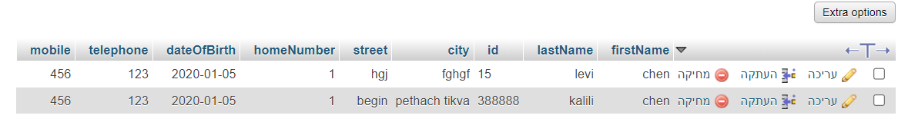
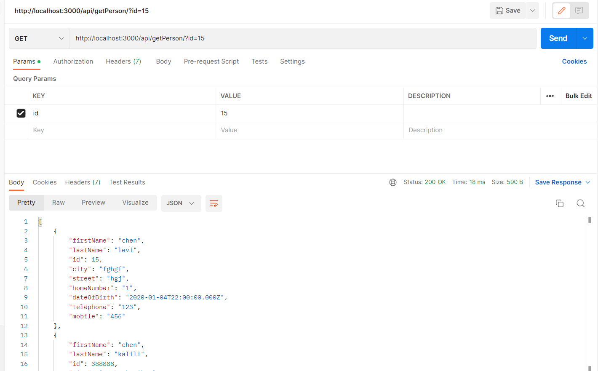
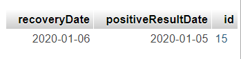
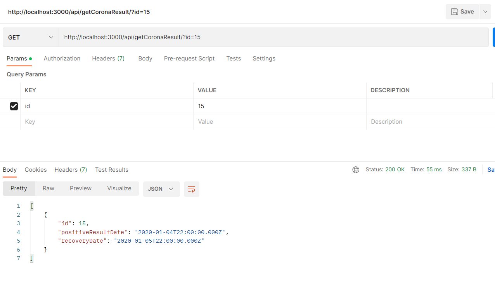
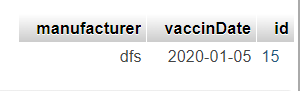
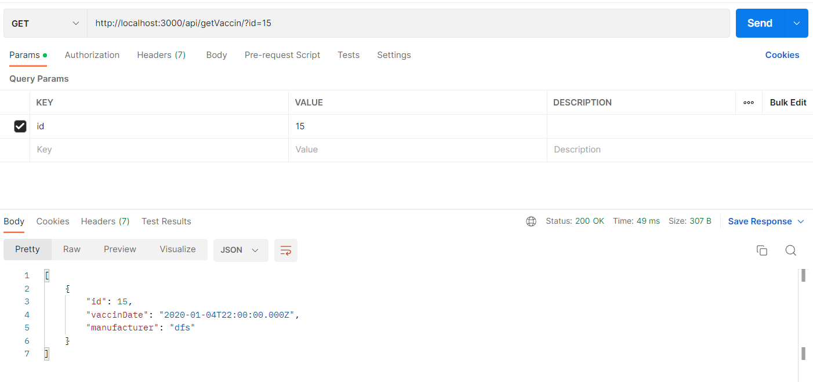
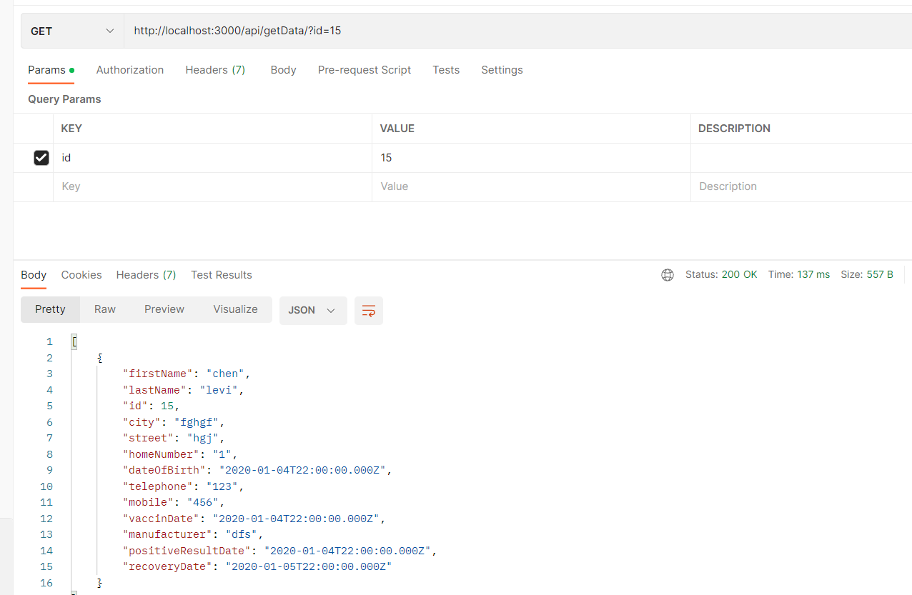

chen kalili. id=325060911

I ran the client side through Postman

I saved the data in 3 tables, in order to get a logical division

----------------------------------------------------

personal_details table contains the following data:
* firstName * lastName * id * city * street * homeNumber * dateOfBirth * telephone * mobile

add data:
POST: http://localhost:3000/api/addPerson/? - (add the whole data)

get data:
GET: http://localhost:3000/api/getPerson/?

----------------------------------------------------

corona_results_dates table contains the following data:
* id * positiveResultDate * recoveryDate

add data:
POST: http://localhost:3000/api/addCoronaResults/? - (add the whole data)

get data:
GET: http://localhost:3000/api/getCoronaResults/?

----------------------------------------------------

vaccination_details table contains the following data:
* id * vaccinDate * manufacturer

add data:
POST: http://localhost:3000/api/addVaccin/? - (add the whole data)

get data:
GET: http://localhost:3000/api/getVaccin/?

----------------------------------------------------

To get the whole data:
GET: http://localhost:3000/api/getData/?

----------------------------------------------------

Bonus:
* GET: http://localhost:3000/api/getPatientsByDay/?
* GET: http://localhost:3000/api/getUnvaccinated/?
